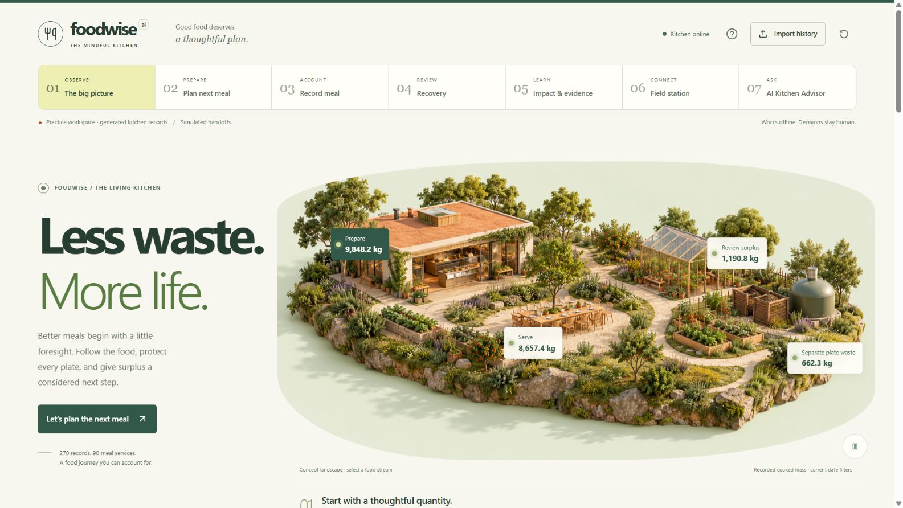
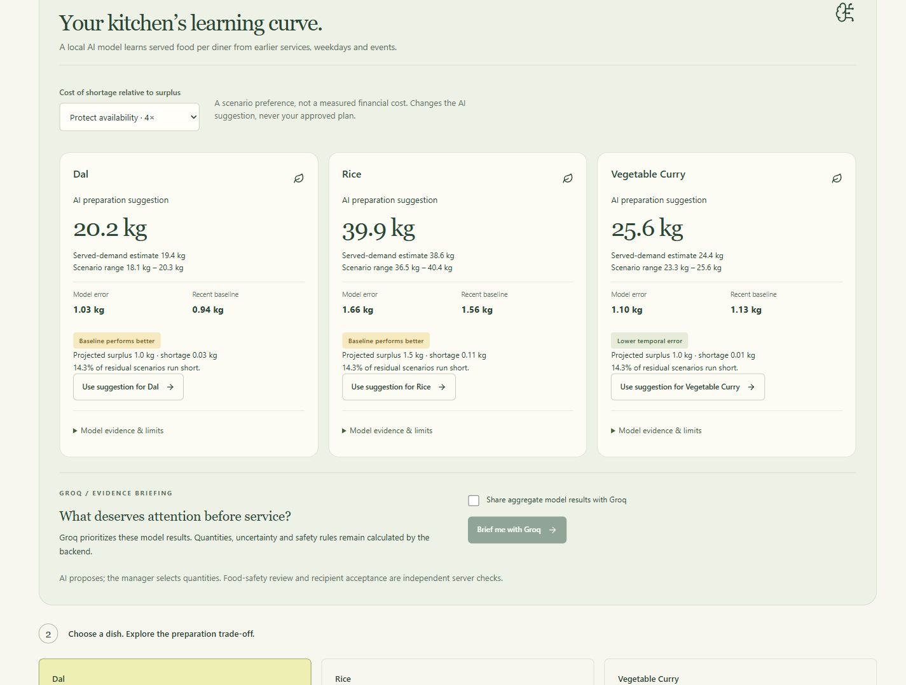
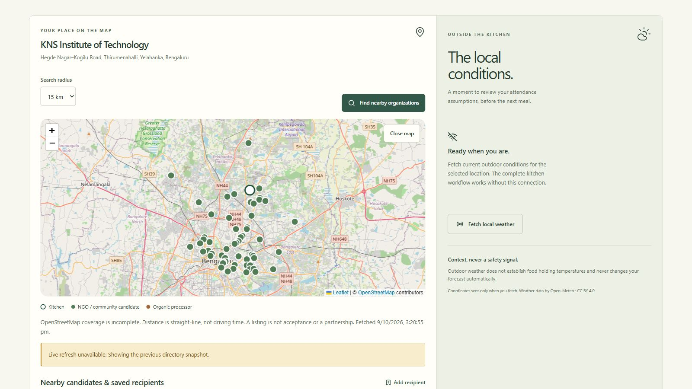
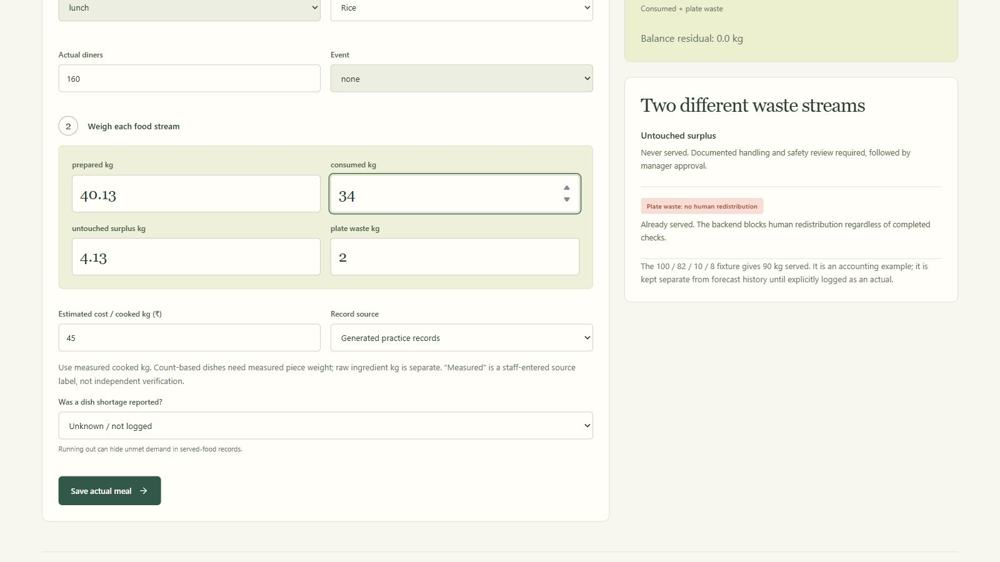
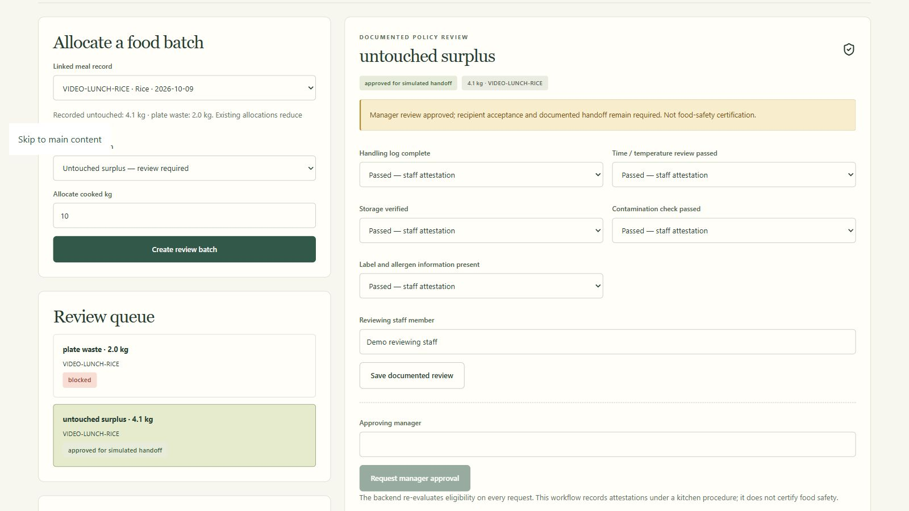
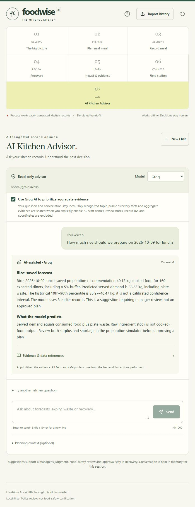
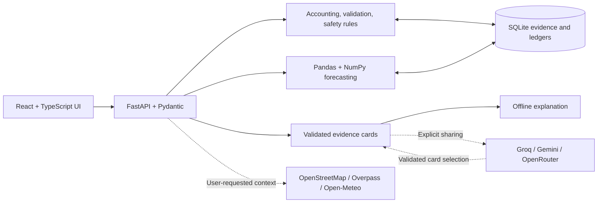

<div align="center">


# FoodWise AI

### Less waste. More life.

**AI-powered meal planning, accountable food flows, and responsible surplus decisions.**

Built for campus kitchens. Demonstrated around KNS Institute of Technology, Bengaluru.

[](frontend/package.json)
[](frontend/tsconfig.json)
[](frontend/vite.config.ts)
[](frontend/package.json)
[](backend/app/main.py)
[](backend/requirements.txt)
[](backend/app/db.py)
[](#ai-that-explains-evidence)

[](docs/PUBLISH_VALIDATION.md)
[](docs/PUBLISH_VALIDATION.md)
[](#quick-start)

[Explore the workflow](#one-connected-kitchen-workflow) · [Quick start](#quick-start) · [Screenshots](#inside-the-application) · [Judge walkthrough](#three-minute-walkthrough) · [Architecture](#architecture)

</div>



<p align="center"><em>Actual application capture using generated practice records. The landscape is conceptual; the food quantities come from backend accounting.</em></p>

## Why FoodWise

Preparing less food is useful only if everyone can still eat. FoodWise helps kitchen managers weigh that trade-off before service, account for what happened afterward, and give each remaining food stream a documented next step.

The application connects demand forecasting with preparation approval, meal logging, recovery review, and evidence. A bright paper-and-forest interface makes the workflow approachable without hiding uncertainty, shortage risk, or the decisions that require a person.

**Local first:** the kitchen workflow and trained local forecasting model work without an API key or internet after dependencies are installed. Connected AI, map discovery, and weather are available through explicit user actions.

## One connected kitchen workflow

| Stage | What a manager can do |
| --- | --- |
| **Observe** | Inspect cooked-food accounting, normalized waste findings, source records, and ingredient expiry alerts. |
| **Prepare** | Forecast served food using expected attendance, compare historical uncertainty and temporal backtests, and simulate both surplus and shortage. |
| **Approve** | Select preparation quantities, retain their assumptions and evidence, and save a manager-approved plan. |
| **Account** | Log consumed food, untouched surplus, and plate waste against a plan, with backend mass-balance validation. |
| **Review** | Document handling evidence, obtain manager approval, plan eligible same-day reuse, and record supported recovery routes. |
| **Learn** | Compare plans with actual meals, inspect the reuse ledger, and distinguish recorded outcomes from projected prevention and theoretical energy. |
| **Connect & ask** | Discover nearby public-directory candidates, review local weather, and ask the AI Kitchen Advisor about validated kitchen evidence. |

### Accounting that follows the food

```text
Prepared cooked food = Consumed food + Untouched surplus + Plate waste
Served-food demand   = Consumed food + Plate waste
Fresh preparation    = Planned total food − Approved reused food
```

Cooked-food quantities use **kilograms**. Count-based dishes require an explicit measured piece weight. Raw ingredient inventory is tracked separately; raw kilograms are never silently treated as cooked output. Linked reuse retains provenance so food transferred between meals is not counted twice as newly prepared food.

## Inside the application

<table>
  <tr>
    <td width="50%">
      <a href="docs/screenshots/prep-coach.png"></a>
      <strong>AI preparation coach</strong><br />Local learning, visible baselines, and explicit shortage trade-offs.
    </td>
    <td width="50%">
      <a href="docs/screenshots/campus-map.png"></a>
      <strong>KNSIT Field station</strong><br />Sourced nearby candidates, cached directory evidence, and local context.
    </td>
  </tr>
  <tr>
    <td width="50%">
      <a href="docs/screenshots/meal-accounting.png"></a>
      <strong>Meal accounting</strong><br />Measured fields, linked preparation plans, and server validation.
    </td>
    <td width="50%">
      <a href="docs/screenshots/recovery-review.png"></a>
      <strong>Responsible recovery</strong><br />Documented handling checks and a separate manager decision.
    </td>
  </tr>
</table>

<details>
<summary><strong>See the AI Kitchen Advisor on a narrow screen</strong></summary>

<p align="center">
  
</p>

</details>

Screenshots are real browser captures from the practice workspace, not interface mockups. They show different checkpoints and may contain different dataset versions. Map markers do not establish recipient acceptance. [Capture context and attribution](docs/screenshots/README.md).

## AI that explains evidence

FoodWise combines local prediction with constrained, provider-assisted evidence:

| Component | How it works | Decision boundary |
| --- | --- | --- |
| **Attendance-aware forecast** | Recency-weighted served food per diner, matching weekday/event history, descriptive ranges, and strictly earlier-date backtests. | Sparse history requires a manager-entered quantity. Historical ranges are not calibrated guarantees. |
| **Local AI prep coach** | A NumPy ridge model learns served food per diner from prior services, calendar features, and declared events; rolling evaluations compare it with a recent baseline. | A model can lose to the baseline. Managers choose whether to apply a suggestion. Confirmed shortages block automatic application where demand may be censored. |
| **AI Kitchen Advisor** | Groq by default, or Gemini, prioritizes validated evidence cards. The shared provider adapter also supports OpenRouter in Field station. The server supplies displayed facts, quantities, and source references. | Read only. AI cannot approve food, alter calculations, contact recipients, or execute a handoff. Invalid or unavailable provider output falls back to a deterministic local response. |

Provider sharing is off until explicitly enabled. Raw questions, conversation history, staff names, private review notes, internal record IDs, and coordinates are excluded from provider payloads. Recognized topics, public directory facts, and aggregate evidence may be shared with the chosen provider. Keys stay on the backend.

[Advisor implementation and privacy](docs/AI_KITCHEN_ADVISOR.md) · [Research review and adoption decisions](docs/RESEARCH_REVIEW.md)

## Quick start

**Requirements:** Python **3.12+**, Node.js **22+**, npm, and Git. The commands below use Windows PowerShell; `npm.cmd` avoids PowerShell execution-policy issues.

### 1. Clone and install

```powershell
git clone https://github.com/Tayab-Ahamed/FoodWise-AI.git
Set-Location FoodWise-AI

python -m venv .venv
.\.venv\Scripts\python.exe -m pip install -r backend\requirements.lock.txt

Set-Location frontend
npm.cmd ci
Set-Location ..
```

### 2. Start the backend

From the repository root in the first terminal:

```powershell
.\.venv\Scripts\python.exe -m uvicorn backend.app.main:app --host 127.0.0.1 --port 8000
```

### 3. Start the frontend

From the repository root in a second terminal:

```powershell
Set-Location frontend
npm.cmd run dev
```

| Service | Local address |
| --- | --- |
| Application | [127.0.0.1:5173](http://127.0.0.1:5173) |
| Interactive API documentation | [127.0.0.1:8000/docs](http://127.0.0.1:8000/docs) |
| Health endpoint | [127.0.0.1:8000/api/health](http://127.0.0.1:8000/api/health) |

SQLite initializes automatically on first launch and preserves records across restarts. No `.env` or API key is needed for the core workflow. Keep both terminals open; **Ctrl+C** stops each service. These addresses are local to your machine, not a hosted public deployment.

<details>
<summary><strong>macOS / Linux equivalents</strong></summary>

```bash
git clone https://github.com/Tayab-Ahamed/FoodWise-AI.git
cd FoodWise-AI
python3 -m venv .venv
.venv/bin/python -m pip install -r backend/requirements.lock.txt
npm --prefix frontend ci

# Terminal 1, repository root:
.venv/bin/python -m uvicorn backend.app.main:app --host 127.0.0.1 --port 8000

# Terminal 2, repository root:
npm --prefix frontend run dev
```

Windows is the verified local environment. These equivalent POSIX commands have not been separately exercised on macOS or Linux.

</details>

### Connect Groq or another provider

Create a private root `.env` once, preserving any existing configuration:

```powershell
if (!(Test-Path -LiteralPath .env)) {
    Copy-Item -LiteralPath .env.example -Destination .env
}
notepad .env
```

Set `GROQ_API_KEY` and an available `GROQ_MODEL`, then restart the backend. The same file supports `GEMINI_API_KEY` / `GEMINI_MODEL` and `OPENROUTER_API_KEY` / `OPENROUTER_MODEL`. Exact model availability depends on the provider account; the example records previously verified identifiers rather than assuming every account supports them.

In **AI Kitchen Advisor** or **Field station**, select a provider and explicitly enable aggregate evidence sharing. Missing keys, connection failures, and invalid responses preserve the offline workflow. Never put credentials in `VITE_` variables, frontend code, screenshots, or commits.

### Start an empty operations workspace

Stop the backend first. In its terminal, from the repository root:

```powershell
$env:FOODWISE_DEMO = 'false'
$env:FOODWISE_DB = 'backend/operations.sqlite3'
.\.venv\Scripts\python.exe -m uvicorn backend.app.main:app --host 127.0.0.1 --port 8000
```

This uses a separate empty database and disables practice reset, fixture, and simulated-handoff controls. Record weighed observations or preview a CSV import; uploaded records retain an unverified source label. The original practice database remains intact. [Detailed operations guide](docs/LOCAL_PROJECT_GUIDE.md).

## Three-minute walkthrough

Use the seeded practice workspace and planning date **2026-10-09**, lunch, **160 expected diners**, no event, and **5% buffer**. The header's **?** button opens the built-in guide.

1. **Observe:** open The big picture, inspect Friday rice surplus, and follow its record evidence.
2. **Prepare:** calculate lunch demand, select Rice, and move the preparation quantity down and up to reveal shortage and surplus. Compare the temporal backtest, then approve a manager-selected plan.
3. **Account:** load the separate 100 kg accounting fixture. It balances as **82 consumed + 10 untouched + 8 plate waste**; served food is **90 kg**. Save the practice actual.
4. **Review:** document handling checks and obtain manager approval for untouched surplus. Demonstrate eligible lunch-to-dinner reuse, log dinner against its approved plan, and show that plate waste is blocked from human redistribution.
5. **Learn & ask:** inspect recorded reuse and simulated processing separately, open the KNSIT map, then ask the advisor what the evidence supports.

The one-row accounting fixture is deliberately separate from the **270-row / 90-day forecast history**. Do not replace forecast history with it. Repeated walkthroughs need distinct actual IDs or an explicit practice reset.

[Exact click-by-click walkthrough](docs/DEMO_WALKTHROUGH.md) · [Original judge script](docs/06_JUDGE_DEMO.md)

## Architecture



The backend owns every calculation, approval transition, allocation, and receipt. Atomic CSV imports use expiring, hash-linked preview tokens. Saved forecasts and plans retain their evidence; later observations influence new forecasts without rewriting past decisions. LLM output is constrained and validated before any selected evidence is displayed.

```text
FoodWise-AI/
├── backend/
│   ├── app/                  # API, domain rules, forecasting, advisor, SQLite
│   ├── tests/                # Domain and acceptance scenarios
│   └── requirements.lock.txt # Pinned Python environment
├── frontend/
│   ├── src/pages/            # Seven workflow screens
│   ├── src/components/       # Simulator, evidence, recovery, landscape
│   └── public/               # Bundled illustration and favicon
├── data/                     # Generated history and separate fixtures
├── docs/                     # Specifications, research, validation, screenshots
├── references/               # Original problem statement and workflow
├── scripts/                  # Import fixtures, experiments, opt-in provider check
└── .env.example              # Configuration template without credentials
```

## Verification

Latest local publication checks, **9 October 2026**:

| Check | Result |
| --- | --- |
| Backend domain and acceptance suite | **163 passed**, including 32 advisor cases |
| Frontend TypeScript | **Passed** |
| Frontend production build | **Passed** |
| Connected judge scenario | **16 assertions passed** during video preparation |
| Browser workflow | Executed locally; captures appear above |

The badges summarize these recorded checks; they are not a hosted CI status. [Publication check details](docs/PUBLISH_VALIDATION.md) distinguish this run from earlier implementation and browser verification.

Reproduce from the repository root:

```powershell
.\.venv\Scripts\python.exe -m pytest backend\tests -q
Set-Location frontend
npm.cmd run typecheck
npm.cmd run build
```

Tests use isolated temporary databases. They cover CSV rollback, earlier-only training, served-demand accounting, simulator arithmetic, stale-plan rejection, persistence, mass balance, approval invalidation, allocation limits, idempotent receipts, plate-waste blocking, reuse provenance, and provider fallback.

## Data, safety, and scope

- **Practice data is generated.** No measured KNSIT kitchen dataset or field-validated waste reduction is claimed. Actual observations and unverified uploads keep their own provenance.
- **Untouched is not automatically eligible.** Handling/storage evidence and manager approval are required. Eligibility is a policy review, not food-safety certification.
- **Plate waste never enters human redistribution.** The backend enforces this independently of the UI, provider output, or manager intent.
- **A map pin is not acceptance.** The app does not contact NGOs or arrange collections. Staff-recorded acceptance, material compatibility, capacity, and receipts remain separate requirements.
- **Impact categories stay separate.** Recorded reuse, simulated handoffs, projected prevention, and theoretical biogas energy are not interchangeable. Outdoor weather does not certify holding temperature.
- **Local execution is the supported deliverable.** There is no authentication, autonomous agent, vector database, IoT integration, or public deployment configuration.

## Documentation

| Guide | Contents |
| --- | --- |
| [Product specification](docs/01_PRODUCT.md) | Original goals and P0 scope |
| [Domain and data](docs/02_DOMAIN_AND_DATA.md) | Accounting, forecasting, and safety contracts |
| [API specification](docs/03_TECH_AND_API.md) | Routes and request/response design |
| [Acceptance scenarios](docs/05_BUILD_AND_ACCEPTANCE.md) | Required behavior and verification |
| [Research review](docs/RESEARCH_REVIEW.md) | Papers, open-source references, adopted methods, and limitations |
| [AI Kitchen Advisor](docs/AI_KITCHEN_ADVISOR.md) | Provider boundary, privacy, and prior live checks |
| [Local project guide](docs/LOCAL_PROJECT_GUIDE.md) | Extended setup, reset, CSV rehearsal, and feature notes |

## Contributing and attribution

Open an issue with the affected workflow, reproduction steps, and expected behavior. For changes, preserve source specifications and fixtures, keep calculations on the backend, and run the checks above. Do not submit credentials, operational databases, or private recipient records.

Map data: **© OpenStreetMap contributors**, displayed through Leaflet; weather context: **Open-Meteo**. The landscape is a bundled concept illustration. Research sources and adoption decisions are credited in the research review; screenshot context is documented alongside the images.

This repository does not yet include a project license. Third-party libraries and reference materials retain their respective licenses and terms.

<div align="center">

**A little foresight. A lot less waste.**

[Tayab Ahamed](https://github.com/Tayab-Ahamed) · [Report an issue](https://github.com/Tayab-Ahamed/FoodWise-AI/issues)

</div>
